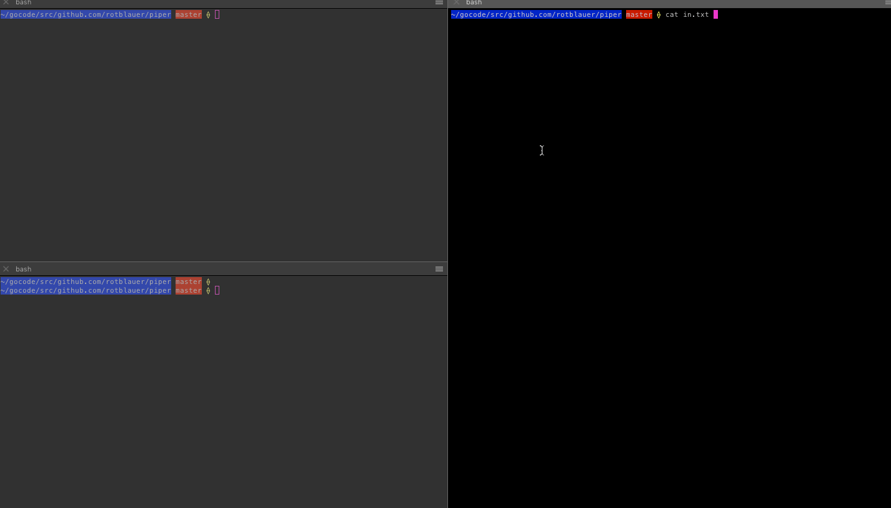

Console-based interactive builder for shell one-liners.



```
Usage of piper:
  -b string
    	base command to grab from in file (default "cat")
  -i string
    	file to manipulate (default "./in.txt")
  -o string
    	file to generate (default "./out.txt")
  -s string
    	base command to grab from in file (default "bash -c")
```

```
Reading in from: /Users/ia/gocode/src/github.com/rotblauer/piper/in.txt
Sending out to: /Users/ia/gocode/src/github.com/rotblauer/piper/out.txt

    | grep ok        <- append command '| grep ok'
    :r N             <- remove N command
    :e N | grep ok   <- change N command to '| grep ok'
    :i N | grep ok   <- insert command at index N as '| grep ok'
    :w ./file.sh     <- save runnable and loadable file from current command
    :l ./file.sh     <- load from file
    :h               <- help
    :q               <- quit

--------------------------
Executed: bash -c cat /Users/ia/gocode/src/github.com/rotblauer/piper/in.txt
--------------------------
Command:

    [0]  cat /Users/ia/gocode/src/github.com/rotblauer/piper/in.txt


```
